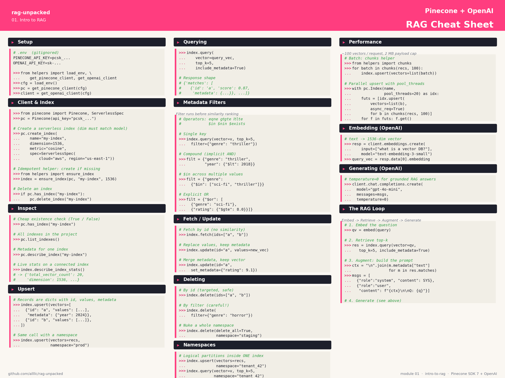

# RAG Unpacked

A hands-on exploration of Retrieval-Augmented Generation, from the basics to advanced patterns.

RAG is the technique of grounding a language model's responses in external knowledge: retrieve relevant context from a data store, then generate an answer that cites it. This repo unpacks the idea across five modules, each a self-contained project exploring a different facet of the problem.

## Module 01 cheat sheet

The intro module ships with a one-page cheat sheet covering every Pinecone + OpenAI call used across the three notebooks:



Source: [`01-intro-to-rag/scripts/render_cheatsheet.py`](./01-intro-to-rag/scripts/render_cheatsheet.py). Regenerate with `python scripts/render_cheatsheet.py` from inside the module.

## Modules

| # | Module | Description | Status |
|---|--------|-------------|--------|
| 01 | [Intro to RAG](./01-intro-to-rag/) | The canonical pattern: embeddings, a vector database (Pinecone), and a retrieval-augmented prompt. Three notebooks, crawl / walk / run. | 🚧 In progress |
| 02 | [Graph RAG](./02-graph-rag/) | Retrieval over a knowledge graph using Neo4j and LangChain, for cases where structure beats similarity. | 📋 Planned |
| 03 | [Vectorless RAG](./03-vectorless-rag/) | Retrieval without embeddings. BM25, keyword search, and why you don't always need a vector store. | 📋 Planned |
| 04 | [Evaluating RAG](./04-evaluating-rag/) | Measuring what matters: faithfulness, answer relevance, context precision. | 📋 Planned |
| 05 | [Advanced RAG](./05-advanced-rag/) | Re-ranking, query rewriting, hybrid search, and the other patterns that move the needle in production. | 📋 Planned |

## Getting started

Each module has its own README with setup instructions and dependencies. Clone the repo and jump into whichever module interests you:

```bash
git clone https://github.com/allllc/rag-unpacked.git
cd rag-unpacked/01-intro-to-rag
```

## License

MIT. See [LICENSE](./LICENSE).
