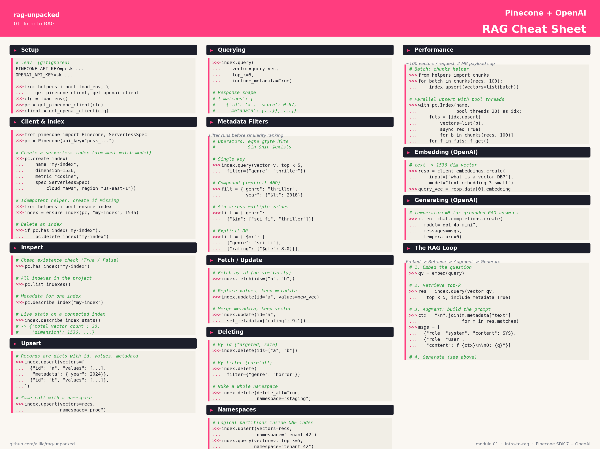
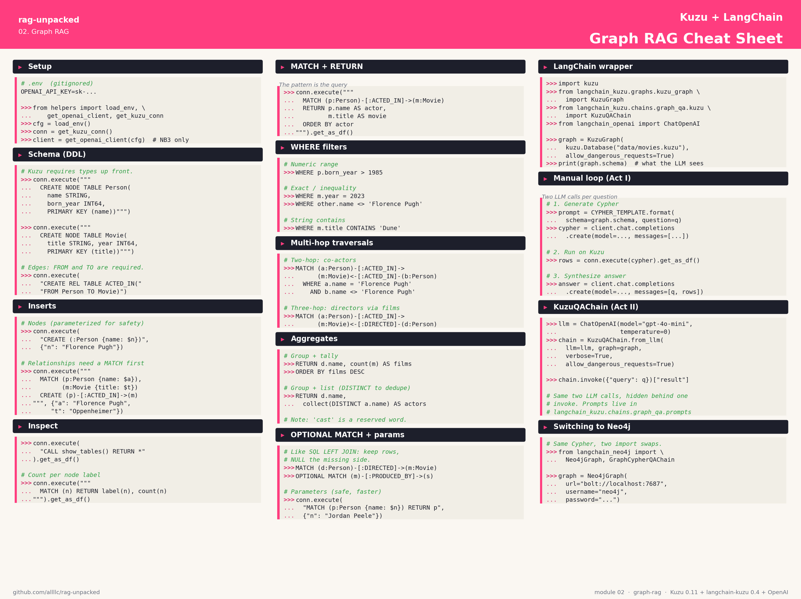
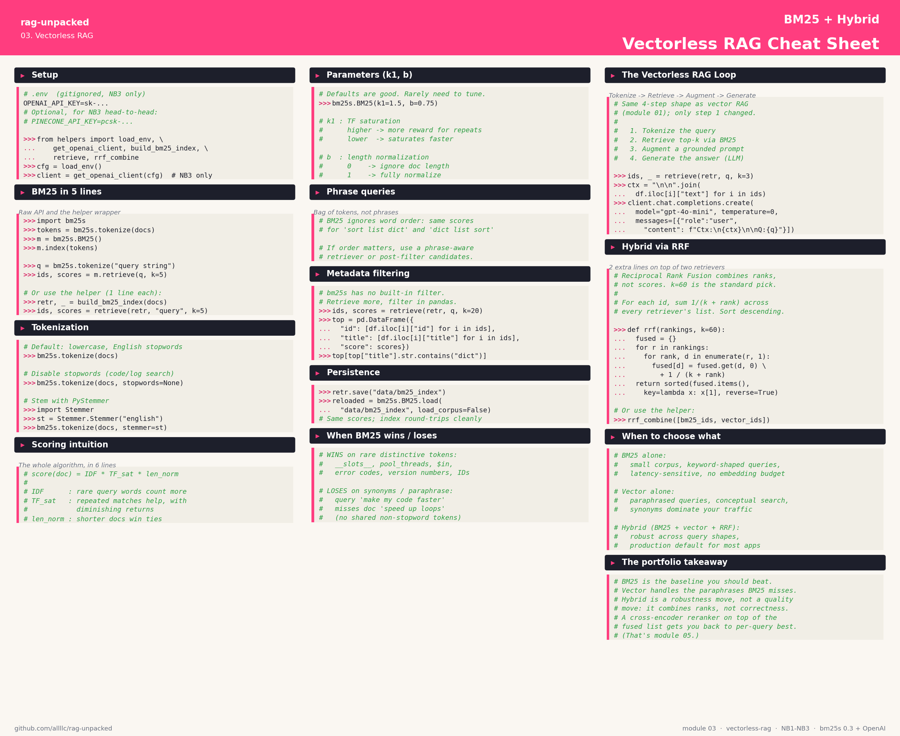
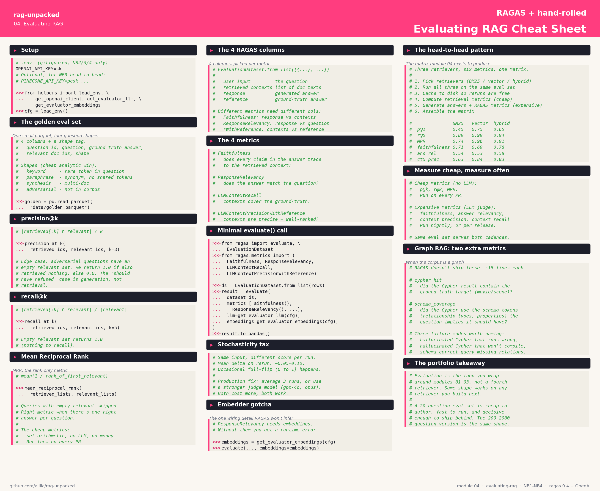

# RAG Unpacked

A hands-on exploration of Retrieval-Augmented Generation, from the basics to advanced patterns.

RAG is the technique of grounding a language model's responses in external knowledge: retrieve relevant context from a data store, then generate an answer that cites it. This repo unpacks the idea across five modules, each a self-contained project exploring a different facet of the problem.

## Module 01 cheat sheet

The intro module ships with a one-page cheat sheet covering every Pinecone + OpenAI call used across its three notebooks:



Source: [`01-intro-to-rag/scripts/render_cheatsheet.py`](./01-intro-to-rag/scripts/render_cheatsheet.py). Regenerate with `python scripts/render_cheatsheet.py` from inside the module.

## Module 02 cheat sheet

The graph module has its own one-pager covering Kuzu, openCypher, and the LangChain `KuzuQAChain`:



Source: [`02-graph-rag/scripts/render_cheatsheet.py`](./02-graph-rag/scripts/render_cheatsheet.py).

## Module 03 cheat sheet

The vectorless module covers BM25 (via `bm25s`), the four-step vectorless RAG loop, and hybrid retrieval via Reciprocal Rank Fusion:



Source: [`03-vectorless-rag/scripts/render_cheatsheet.py`](./03-vectorless-rag/scripts/render_cheatsheet.py).

## Module 04 cheat sheet

The evaluation module covers RAGAS, the four LLM-judge metrics, the cheap hand-rolled retrieval metrics, and the six-by-three head-to-head matrix:



Source: [`04-evaluating-rag/scripts/render_cheatsheet.py`](./04-evaluating-rag/scripts/render_cheatsheet.py).

## Modules

| # | Module | Description | Status |
|---|--------|-------------|--------|
| 01 | [Intro to RAG](./01-intro-to-rag/) | The canonical pattern: embeddings, a vector database (Pinecone), and a retrieval-augmented prompt. Three notebooks, crawl / walk / run. | ✅ Shipped |
| 02 | [Graph RAG](./02-graph-rag/) | Retrieval over a knowledge graph using Kuzu (embedded, pip-installable) and LangChain, for cases where structure beats similarity. Three notebooks, same crawl / walk / run arc. | ✅ Shipped |
| 03 | [Vectorless RAG](./03-vectorless-rag/) | BM25 and hybrid retrieval. The baseline you should beat before reaching for vectors. Three notebooks, including a head-to-head against module 01's vector index. | ✅ Shipped |
| 04 | [Evaluating RAG](./04-evaluating-rag/) | RAGAS, the four LLM-judge metrics, hand-rolled precision/recall/MRR, and a six-by-three head-to-head matrix across vector / BM25 / hybrid. Four notebooks. | ✅ Shipped |
| 05 | [Advanced RAG](./05-advanced-rag/) | Re-ranking, query rewriting, hybrid search, and the other patterns that move the needle in production. | 📋 Planned |

## Getting started

Each module has its own README with setup instructions and dependencies. Clone the repo and jump into whichever module interests you:

```bash
git clone https://github.com/allllc/rag-unpacked.git
cd rag-unpacked/02-graph-rag
```

## License

MIT. See [LICENSE](./LICENSE).
